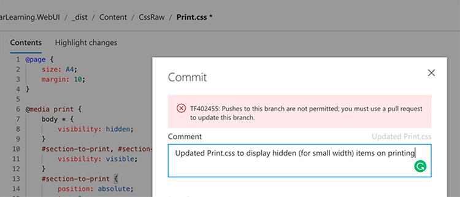
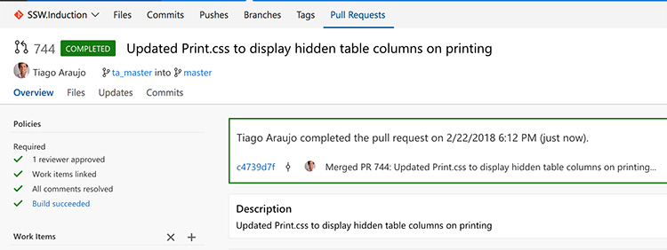
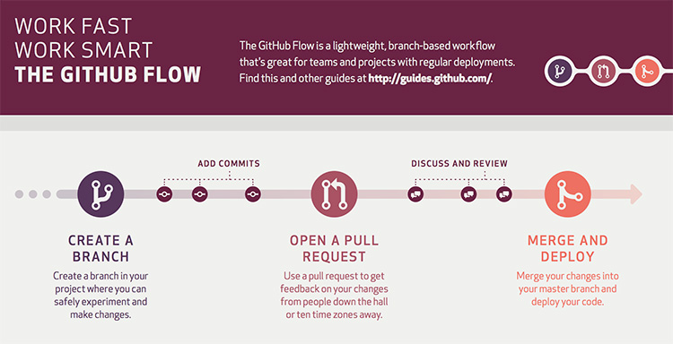
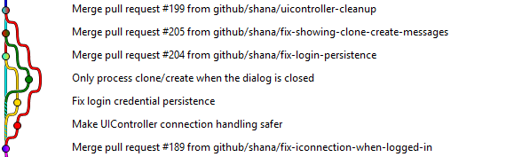
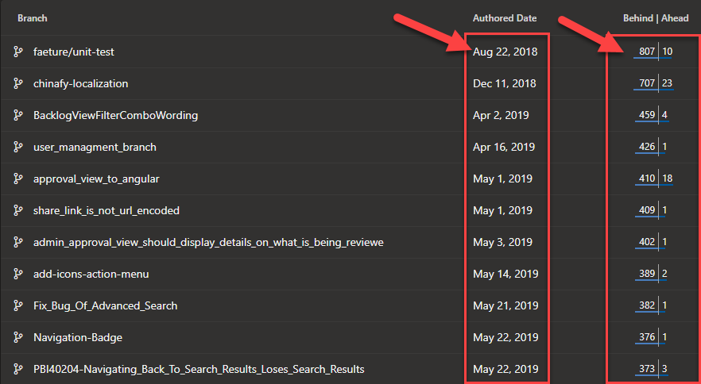
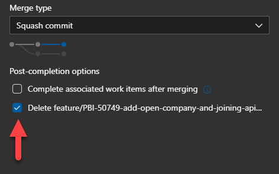
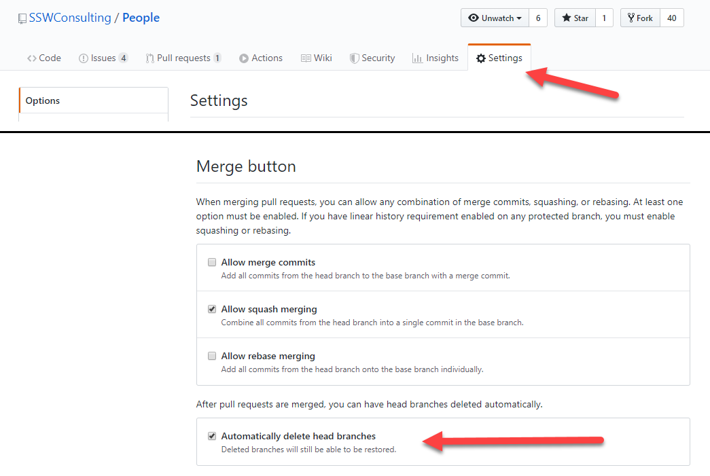

Note: This rule applies to git. For branching advice in TFVC, see [Do you know when to branch in TFVC?](/_layouts/15/FIXUPREDIRECT.ASPX?WebId=3dfc0e07-e23a-4cbb-aac2-e778b71166a2&TermSetId=07da3ddf-0924-4cd2-a6d4-a4809ae20160&TermId=cd330379-4568-45fa-bd68-7229044697b7)
The best way to handle continuous development and deployment is following [GitHub Flow](https://guides.github.com/introduction/flow/). The basic idea is to always deploy from ** master**, and to create a feature branch for every feature. When the feature is complete, it is merged back to master via a pull request, which provides a trigger for other developers to build.

Using this strategy, ** master **is always production-ready and deployable.
 
 

[[badExample]]
| 

[[goodExample]]
|  

[GitHub](https://guides.github.com/pdfs/githubflow-online.pdf) 
### The process

### #assumption

**Set up build system to deploy from the master branch**

Your build systems should always deploy from master, and should automatically deploy on every commit to master.
Since master is always being deployed, it must always be in a deployable state.

### 1) Create a branch

**a) Create a "feature branch" for every PBI**

When starting a PBI from the task board, create a branch from      **master** with a descriptive name for that feature.

[[badExample]]
| 

[[goodExample]]
|  

**It is critical that this branch always comes off master, not another feature branch. Master is the only branch that is mandated to be in a deployable state, so any other option is unsafe.**

Obviously, we're creating a lot of branches and merging a lot under this strategy - and that's ok.  Be sure to keep your PBIs small (as per [do you break large tasks into smaller tasks](/_layouts/15/FIXUPREDIRECT.ASPX?WebId=3dfc0e07-e23a-4cbb-aac2-e778b71166a2&TermSetId=07da3ddf-0924-4cd2-a6d4-a4809ae20160&TermId=2e446681-6eff-4cec-b955-e530edc4cdc8)), and you will not have much merge pain.

The benefit of creating feature branches is to reduce the number of conflicts and churn of unfinished code during development of a feature.  It allows features to be developed independently of each other and reduces the amount of expensive "pull latest from the server, and rebuild everything" operations, as well as greatly limiting the impact of commits with unfinished code.

**b) Code away and complete the PBI**

**c) Create a commit - it will contain your changed files on your local PC **

While working, commit frequently to this branch with nice, descriptive messages. For example, "Added a field to hold the product category to our timesheet read model" and "added a column to the timesheet summary UI for the product category".

[[badExample]]
| 

[[goodExample]]
| 

**d) Push your changes to your remote Feature Branch**

### 2) Open a pull request (to merge from your current branch to the master)

When the change is complete, or when you want feedback on anything, open a pull request to merge the branch back to     ** master**. The pull request is more than just a request to merge, it is a request to have someone review the code and architecture, and to discuss any issues.  Resolve these issues with more commits in the branch before continuing.

Tip: A best practice is to have another developer review your work and then approve.

It is easy to chalk this step up as busy-work, but it is one of the most valuable parts of the strategy

### #assumption

Deploy the changes to a staging environment.  This allows the features to be tested before being merged to     **master**.

Some prefer to move this step to after the merge, especially when using a release management tool like VSTS Release or Octopus Deploy (see     [Do you use the best deployment tool](/_layouts/15/FIXUPREDIRECT.ASPX?WebId=3dfc0e07-e23a-4cbb-aac2-e778b71166a2&TermSetId=07da3ddf-0924-4cd2-a6d4-a4809ae20160&TermId=e2608875-5b0b-4215-bee8-8ffd966dc972)).  If you decide to go this route, remember that     **master** should remain deployable and production ready at all times and that all branches come from      **master**.  If skipping this step, ensure that you have CI on your feature branch to ensure that your branch compiles and passes all tests before merging.

### 3) Merge and Deploy (to master)

Once everyone is happy and everything is tested, complete the pull request, which will merge back to     ** master**. Ensure you are not using the "Fast Forward" merge option (git), or details about the branch will be lost - it will appear as though all work was done in     **master**. Being able to see the feature branches in the git log is very useful.

[[goodExample]]
| 

After you completed the pull request, make sure you also delete the branch     that you made the pull request of. Deleting your completed branch will not just help yourself in the long run, but also everyone else. Having too many branches especially a stale one will confuse developers on what "may" be in progress, moreover it would cause so much pain to the future developer when they have to do a clean-up and the branch author has left.

[[badExample]]
|         

Otherwise, you can do it before you complete the pull request by ticking     delete branch option.

[[goodExample]]
|         

[[goodExample]]
|         

Once merged,      **master** should immediately and automatically be deployed (in a perfect world, to production).
