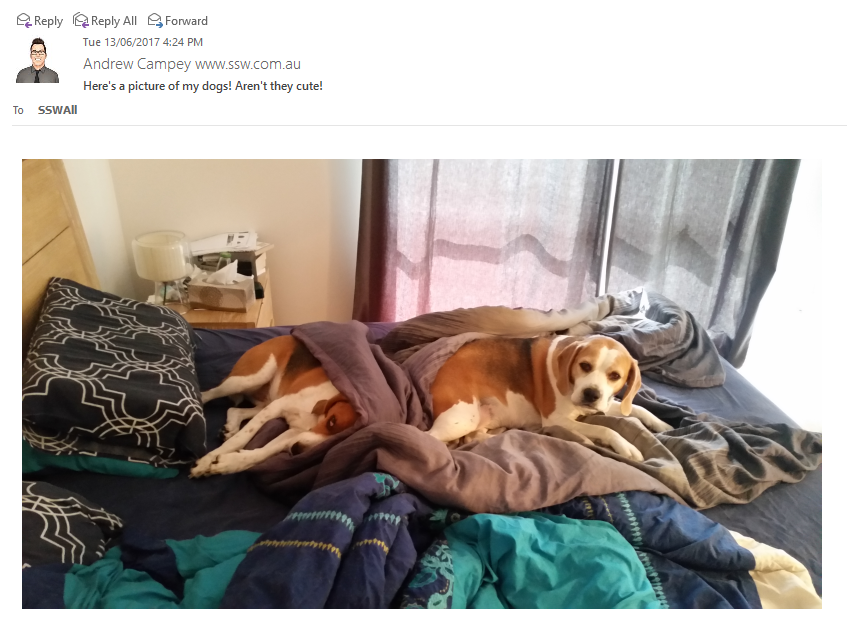
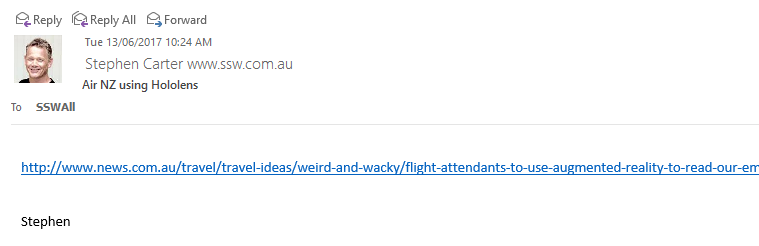
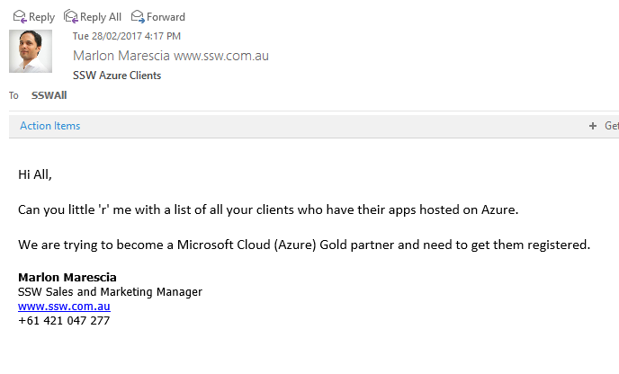

SSW All emails should be used for critical information or emails that require feedback from users.  For general information, or random posts this should be sent via an IM group (in SSW's case Microsoft Teams).

 
SSW All emails serve an important purpose in providing information to the entire organisation in a way that is less likely to get lost than an Instant Message.  Its also provides a good method of allowing for a good cross section of staff responses.  IM messages are better suited to general comments/information or random posts.

Bad Example - No information. Not relevant for all staff to see.

Bad Example - This should have been shared in a group. Not via SSWAll

Good Example - Clearly talks about an outage that will affect all users

Good example - Gets the information out to all staff so that they can respond if they can assist.
