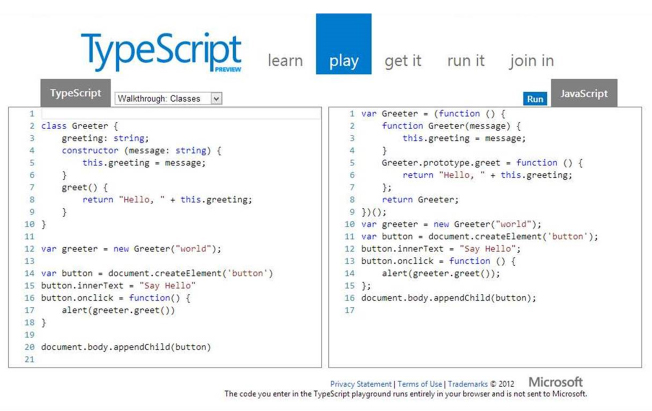
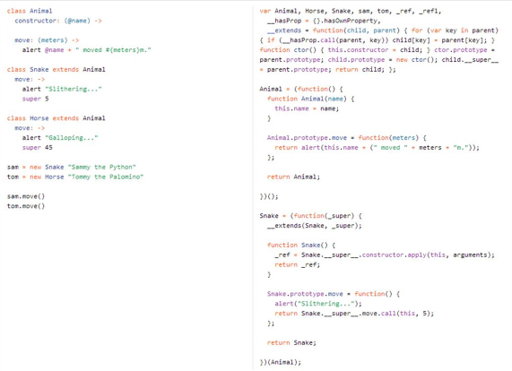

​TypeScript is the new flagship language from Microsoft that compiles into JavasScript.

- Use JavaScript if you’re writing page specific script
- Use jQuery to improve cross-browser support
- Use TypeScript if you’re writing re-usable client side library

Don't use CoffeeScript (language is too different from JavaSript)
 

