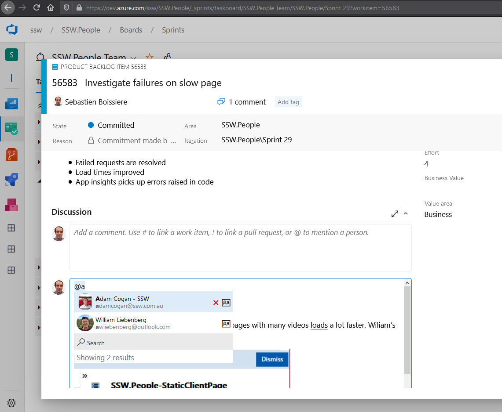

When the Product Owner verbally requests a change to a PBI, how do you update the PBI to reflect the change and also keep track of the conversation?

<!--endintro-->

You could send yourself a "[To Myself](/dones-do-you-send-yourself-emails)" email and update the PBI description accordingly, but only those people included in the email chain are aware of the conversation.
<dl class="badImage"><dt> 
       
   </dt><dd>Figure: Bad Example – don't use emails to update tasks</dd></dl>
Instead, what you should do is use the discussions feature in the PBI and mention the user using "@<username>".  The benefits of using comments are:  </username>

* Quick and easy, no need to compose an email
* History is visible to anyone looking at the PBI (with email, if you don’t cc them, they wouldn’t have a clue)
* Easy to see all important notes/comments in one place instead of digging through email

When someone (especially the PO) asks you to fix a PBI, mention that person in the PBI comments so he knows when it’s fixed.

Example: When replying to "Hey XXX, can you please fix PBI 123?"

::: bad
Bad example: "I have found the PBI and moved it near the top of our backlog"

:::

::: good
Good example: "I have found the PBI, prioritized it near the top, and @mentioned you so you know when it is fixed"

:::

### Azure DevOps PBIs

<dl class="goodImage"><dt> 
       
   </dt><dd>Figure: Good Example – Using @ mentions in Azure DevOps discussion</dd></dl><dl class="goodImage"><dt> 
       
   </dt><dd>Figure: Good Example – Email still gets sent to the users who are mentioned in the discussion, so they can still chime in if any details are incorrect </dd></dl>
### GitHub Issues

<dl class="goodImage"><dt></dt><dd>Figure: Good Example – Using @ mentions in GitHub </dd></dl>

::: greybox
 **Tip:** You can @mention on your pull requests as well.

:::

### Related Links

* [Interruptions - Do you know that IM interrupts?](/know-that-im-interrupts)
* [Suggestion to Microsoft Azure DevOps - Help me know there is an image in the Work Item](https://bettersoftwaresuggestions.com/microsoft/azure-devops/help-me-know-there-is-an-image-in-the-work-item/)
* [Zendesk - Do you reply to the correct Zendesk email?](/do-you-reply-to-the-correct-zendesk-email)
