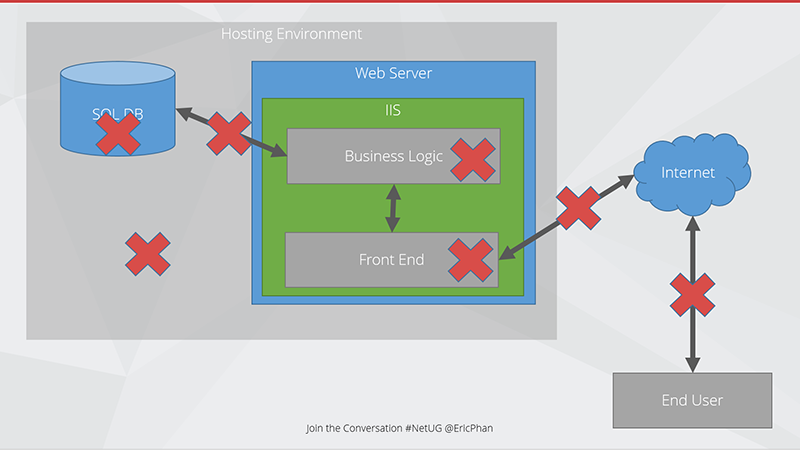

For modern applications, there are many layers and moving parts that need to seamlessly work together to deliver our application to the end user.
   
! Call out diagrammatically where you think the bottlenecks are happenning

The issues can be in:

### SQL Server

- Slow queries
- Timeouts
- Bad configuration
- Bad query plans
- Lack of resources
- Locking

### Business Logic

- Inefficient code
- Chatty code
- Long running processes
- Not making use of multicore processors

### Front end

- Too many requests to server a page
- Page size
- Large images
- No Caching

### Connection between SQL and Web

- Lack of bandwidth
- Too much chatter

### Connection between Web and Internet

- Poor uplink (e.g. 1mbps uploads)
- Too many hops

### Connection between Web and End users

- Geographically too far (e.g. US servers, AU users)

### Infrastructure

- Misconfiguration
- Resource contention
