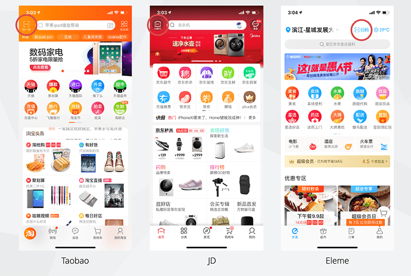

The best place for a QR code scanner is to put it on top of the home page with a “Scanner” icon and labeled “Scan”?
 
[[goodExample]]
|    

QR  code is widely used in Chinafy projects, it is easier for users to find the scanner when it located in a convenient place.​​
