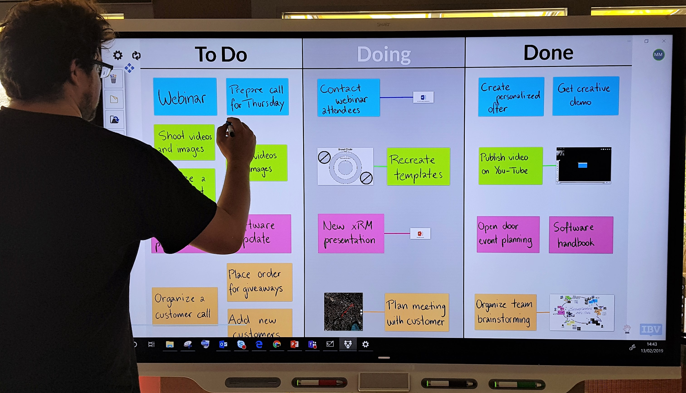
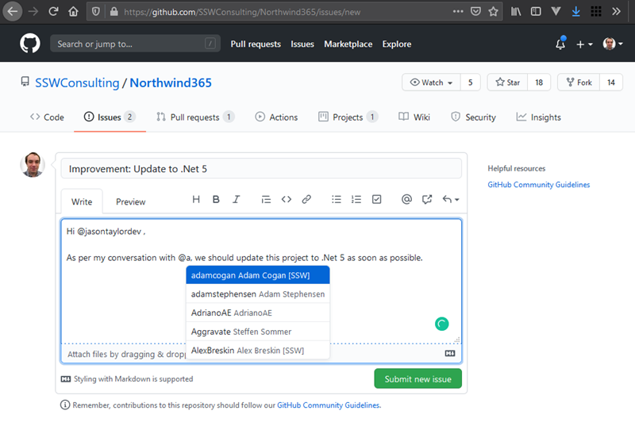

When discussing a PBI/Issue, Pull Request, or a project in general, it is important to do it in the right place.
<dl class="image"><dt> </dt></dl>
<!--endintro-->
<dl class="badImage"><dt>
      
   </dt><dd>Figure: Bad Example – don't use emails to discuss tasks</dd></dl>
### For code

Sometimes developers need to discuss code implementations - sometimes to improve the code, other times to explain why something was done a certain way.

This should be done in the Pull Request, if possible comment directly on the line of the code change and once resolved, make sure that the important information is captured in the merge's commit description.
<dl class="goodImage"><dt> 
      
   </dt><dd>Figure: You can add a comment on a specific line of code</dd></dl>
### For a new PBI/Issue

As per[Do you know when you use @ mentions in a PBI?](/when-you-use-mentions-in-a-pbi) - Create a new issue mentioning the Product Owner and the related people

<dl class="goodImage"><dt>
      
   </dt><dd>Figure: Good Example - When adding a GitHub issue, @ mention the Product Owner and other related people so they receive a notification e.g, an email</dd></dl>
### For an existing PBI/Issue

Discuss it in the existing PBI/Issue.
<dl class="goodImage"><dt> 
       
   </dt><dd>Figure: You can discuss an existing issue, even when it has been closed</dd></dl>
### For other topics (brainstorm ideas, general discussion, etc.)

You can:

* Create a PBI/Issue
    * use a "discussion" label so that others know that it is just a discussion point and not actionable work yet
    * have it checked by the client before publishing it (recommended)
* Discuss it in the discussion tab in GitHub

<dl class="goodImage"><dt> 
       
   </dt><dd>Figure: You can create discussions on your project using the Discussion tab in your GitHub repository</dd></dl>
* In the team channel in Teams

<dl class="goodImage"><dt> 
       
   </dt><dd>Figure: You can discuss your idea in Teams on the team channel </dd></dl>
In summary, Email should be the last resort.
