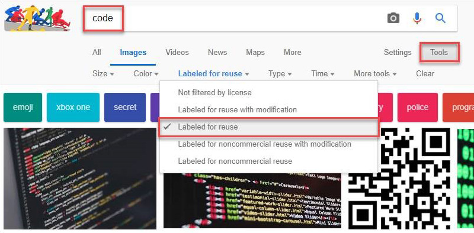

You will need to ensure that you have the rights to use these featured images. A few options include:
 
1. Purchasing a subscription to a stock image site
2. Using a royalty-free stock image site. E.g. [unsplash.com](https://unsplash.com/) or [pxhere.com​](https://pxhere.com/)
3. Using Google Images that are labeled for reuse: 

4. Taking your own photos

Ensuring you are not breaching copyright will save you from any trouble in the future.
