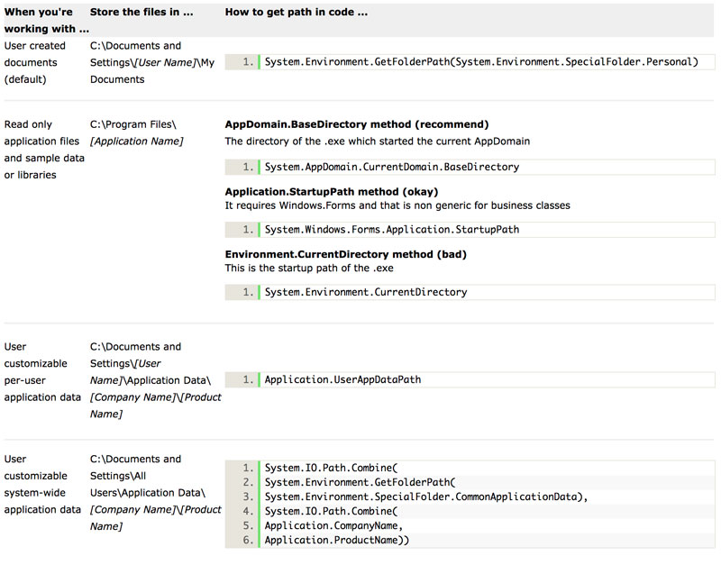

Although many have differing opinions on this matter, Windows has standard storage locations for files for application, whether they're settings or user data. Some will disagree with those standards, but it's safe to say that following it regardless will give users a more consistent and straightforward computing experience.

The following grid shows where application files should be placed:
  

### Further Information

- The System.Environment class provides the most general way of retrieving those paths
- The Application class lives in the System.Windows.Form namespace, which indicates it should only be used for WinForm applications. Other types of applications such as Console and WebForm applications use their corresponding utility classes

Microsoft's write-up on this subject can be found at [Microsoft API and reference catalog](https://www.ssw.com.au/ssw/Redirect/Microsoft/MSDNFileSystem.htm).
