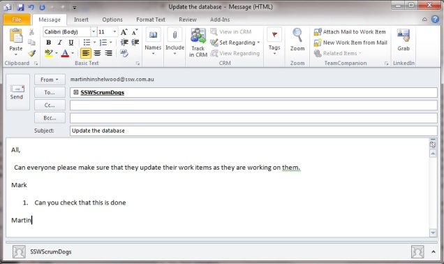

Make sure that anyone tasked in emails is explicitly added to the "To:" line. This helps them identify emails where they have tasks.

A fair percentage of people open an email and don’t read who is on the "To:" or "Cc:" lines.

<!--endintro-->
<dl class="badImage"><dt>
      
   </dt><dd>Figure: Bad example, Mark can’t search for tasks that have been assigned to him </dd></dl><dl class="goodImage"><dt>
      
   </dt><dd>Figure: Good example, Mark can filter his emails based on whether his name is on the "To:" field </dd> 
   </dl>
### Related rule

[Do you include the name of the person you address on the first line?](/do-you-include-the-name-of-the-person-you-address-on-the-first-line)
