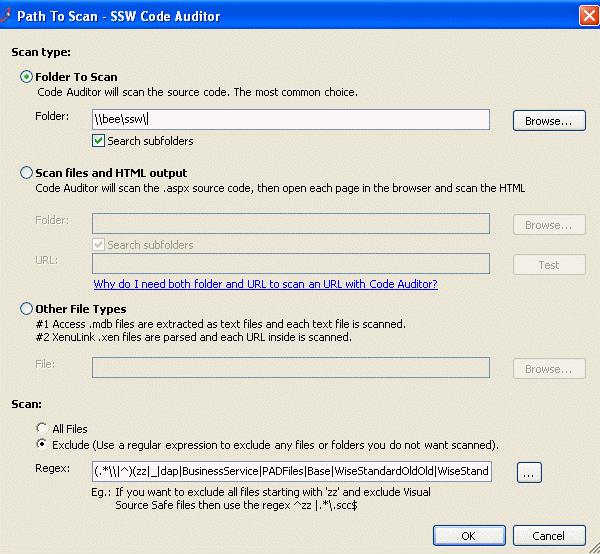

If windows form does not setup a minimum size, your users could have unpredictable form behaviour​ as seen below:

​Figure: Bad Example - Unexpected window form​

 
​Therefore, a standard has been built to ensure Windows forms have a minimum size.

Figu​re: Good Example - User friendly window form​​​
​
