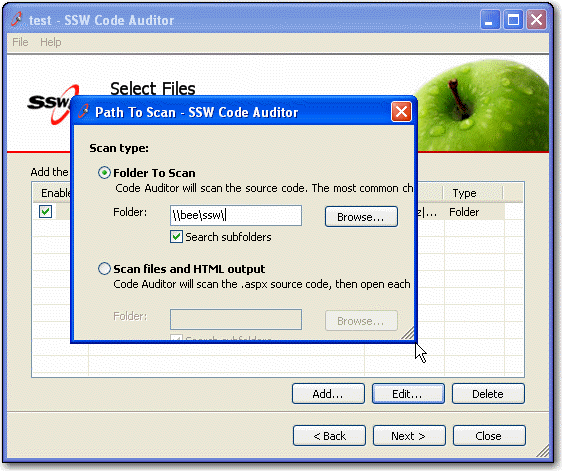

If windows form does not setup a minimum size, your users could have unpredictable form behaviour as seen below:

 
Therefore, a standard has been built to ensure Windows forms have a minimum size.

