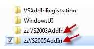

Keeping your projects tidy says good things about the teams maturity. Therefore any files and folders that are prefixed with zz, must be deleted from the project.

<!--endintro-->

[[badExample]]
| 
[[goodExample]]
| 
