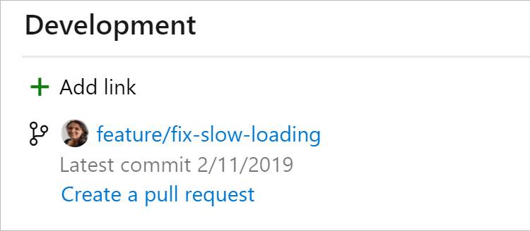

In order to get better clarity on what work is done, it's a good idea to connect your PBI's and tasks to the commits, branches and pull requests that relate to the item. All commits, branches and pull requests should be linked to a PBI.

Bad Example: No linked commit's, branches or pull requests

Good Example: Git branch linked to PBI in TFS
 
Note: If you create your branches through Azure DevOps then you can link them during creation.

Good Example: Using Azure DevOps to link PBI during creation
Here is a handy resource for linking work items:

https://devblogs.microsoft.com/devops/linking-work-items-to-git-branches-commits-and-pull-requests/

Note: You can setup Branch Policies on your main branches to enforce this behaviour.

Good Example: Branch Policy on the master branch to enforce linked work items on pull requests
