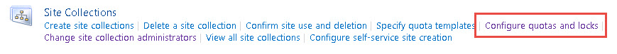
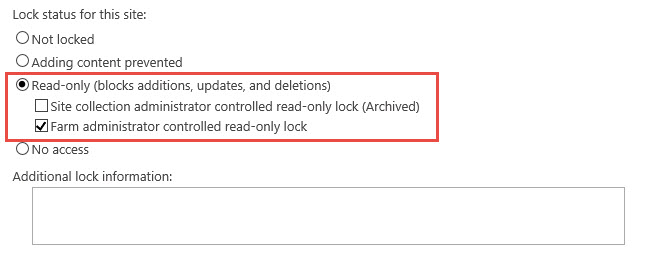
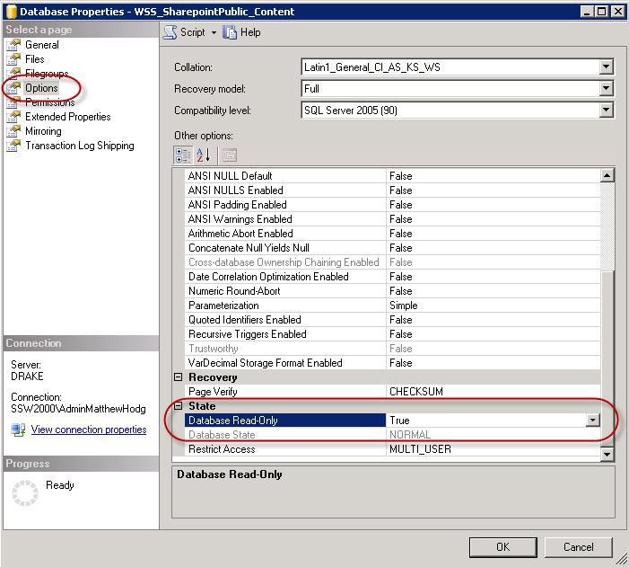

Even though you have advised staff members a migration is taking place – you can guarantee someone will try to check-in or edit documents. The best way to prevent this is to put your content database into read-only mode, locking the content database.
<!--endintro-->

There are two options to lock the content database.

Option 1 ( **Recommended** ):

1.  Open  **SharePoint Central Administration** site, navigate to "**Application Management** " | "**Site Collections** " | " **Configure quotas and locks** ".

::: ok  
  
:::  

2. Select the "site collection" which you would like to lock.

3. Choose "Read-only (blocks additions, updates, and deletions)", then click "OK".

::: ok  
  
:::  

Option 2 ( **not recommended** ):

1.    On your database server open      **SQL Server Management Studio**

2.    Right click on the content database associated with the site collection you're migrating | **Properties**

3.    Choose      **Options** | Scroll to the bottom of the options list

4.    For the      **Database Read-Only** choose True

::: ok  
  
:::  

5.    Now it’s safe to take a backup of your content database

**NOTE:** When some SharePoint timer services are run it may cause the site to display errors when the database is in read-only mode
