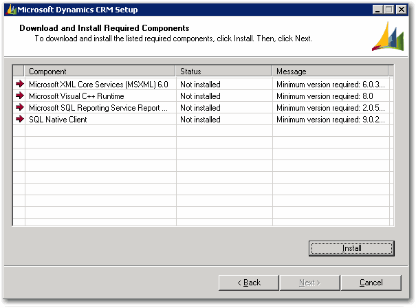

 
As per rule [Installation - Do you log each screen which is different to the default?](/installation-do-you-log-each-screen-which-is-different-to-the-default), it's important that you log each screen so that you can have a historical log of the upgrading.
 
​
Figure: Log Screen For Required Components
