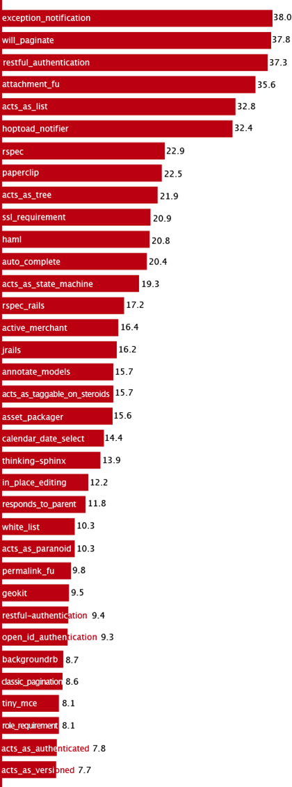
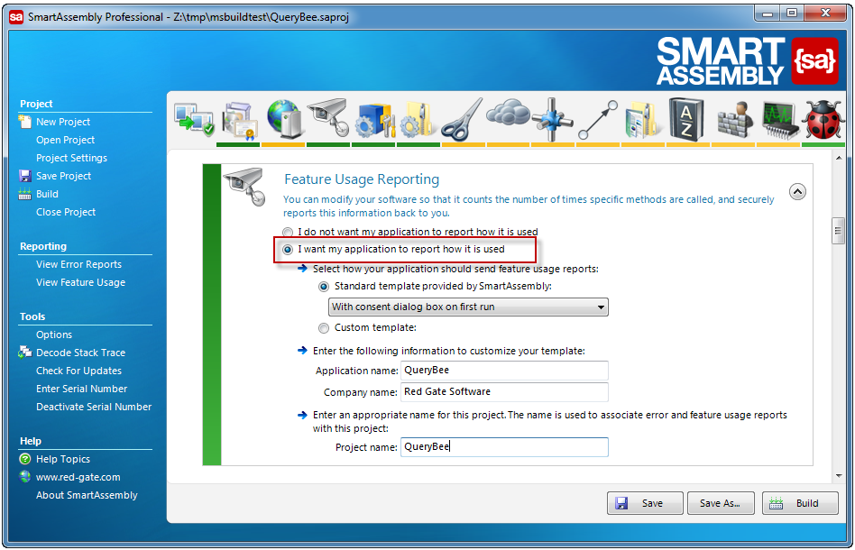

 
So you can see what functions are being used more often (e.g. reports, menu items).​
   ​Plus, you can work out what fields to show on search pages (standard and advanced tabs) and which parameters are being used. 
 Figure: Keep track of what terms are searched most often

You can achieve this with Redgate's [Feature Usage Reporting](http://www.red-gate.com/products/dotnet-development/smartassembly/).
Figure: Smart Assembly Professional keeps tracks of usage
Figure: PA for TFS

