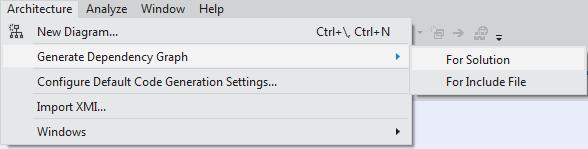
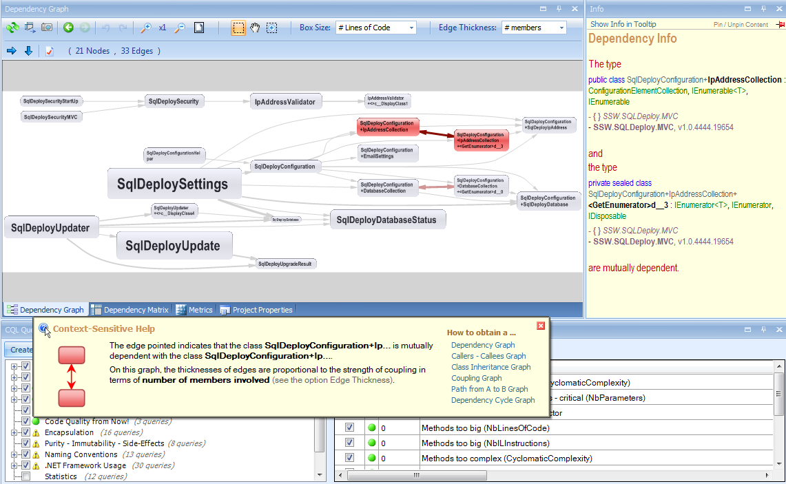

To visualize the structure of all your code you need architecture tools that will analyze your whole solution.

They show the dependencies between classes and assemblies in your projects. You have 2 choices:

* Visual Studio's Dependency Graph. This feature is only available in Visual Studio Ultimate. (recommended)
* If you want architecture tools for Visual Studio, but don't have Visual Studio Ultimate, then the excellent 3rd party solution nDepend. A bonus is that it can also find issues and highlights them in red for easy discovery

<!--endintro-->
<dl class="image"><dt></dt><dd>Figure: Visual Studio lets you generate a dependency graph for your solution</dd></dl><dl class="image"><dt> </dt><dd>Figure: The dependency graph in Visual Studio shows you some interesting information about how projects relate to each other </dd></dl>
nDepend has a similar diagram that is a little messier, but the latest version also includes a "Queries + Rules Explorer" which is another code analysis tool.
<dl class="image"><dt> </dt><dd>Figure: nDepend Dependency Graph. Issues are highlighted in red for easy discovery</dd></dl>
Read more about nDepend: [ndepend.com](http://www.ndepend.com/).

### Related Rule

* [Do you look at the architecture of JavaScript projects?](/look-at-the-architecture-of-JavaScript-projects)
