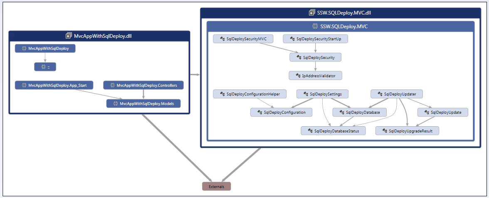

To visualize the structure of all your code you need architecture tools that will analyse your whole solution.

They show the dependencies between classes and assemblies in your projects. You have 2 choices:

- Visual Studio's Dependency Graph. This feature is only available in Visual Studio Ultimate. (recommended)
- If you want architecture tools for Visual Studio, but don't have Visual Studio Ultimate, then the excellent 3rd party solution nDepend. A bonus is that it can also find issues and highlights them in red for easy discovery

 ](ArchitectureToolsVS11.png)

nDepend has a similar diagram that is a little messier, but the latest version also includes a "Queries + Rules Explorer" which is another code analysis tool.
 
Read more about nDepend: [ndepend.com](http://www.ndepend.com/).
