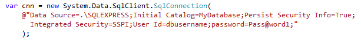
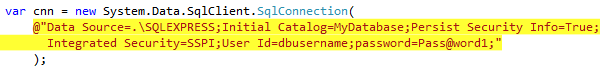
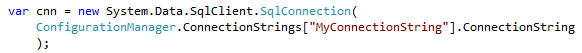

Long hard-coded strings in a codebase can be a sign of poor architecture.
 
To make hard-coded strings easier to find, [consider highlighting them in your IDE](/do-you-highlight-strings-in-your-code-editor).

[[badExample]]
| 

[[goodExample]]
| 
