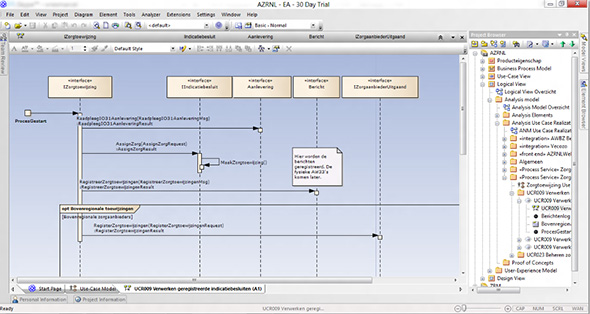
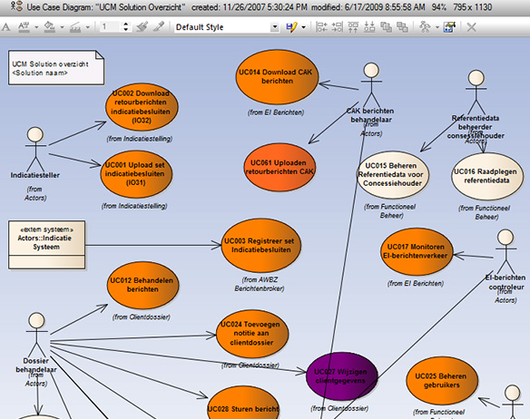

There are a few styles of documentation:
 
### Level 1 - Old School

|  | This team style does a lot of upfront documentation and planning, is very comfortable with Waterfall, and has rarely even heard of Agile :) |
| --- | --- |

- Heavy, long documents
- Sequence Diagrams
- UML

This is a well-established way to do documentation but the issue with it is that it gets out of date.
 

**Exception:** Keep this limited to just enough documentation to cover a couple of sprints, and be committed to keeping it updated. The tool of choice if you're going down this road is Enterprise Architect (an excellent application built by Australians).

### Level 2 - Lots of documentation (and the 6 important documents)

|  | This team style are all under 30 and have never heard of FoxPro or Access  |
| --- | --- |

6 small docs (a couple of pages max + in the order you would read them):

- Documentation\Business.docx - Explaining the business purpose of the app
- Documentation\Instructions-Compile.docx - Contains instructions on how to get the project to compile (aka the F5 experience)
- Documentation\Instructions-Deployment.docx - Describes the deployment process
- Documentation\Patterns-and-Technologies.docx - Explaining the technical overview e.g. Broad architecture decisions, 3rd party utilities, patterns followed etc. (ie. SSW Data Onion)
- Documentation\Definition-of-Done.docx – Ensures that your team [maintains a high level of quality with a Definition of Done](/_layouts/15/FIXUPREDIRECT.ASPX?WebId=3dfc0e07-e23a-4cbb-aac2-e778b71166a2&TermSetId=07da3ddf-0924-4cd2-a6d4-a4809ae20160&TermId=6449ae79-ba88-447e-aa48-36173029a2af)
- Documentation\Definition-of-Ready.docx – Ensure that your PBIs are well defined before adding them to a sprint by specifying a [Definition of Ready](/_layouts/15/FIXUPREDIRECT.ASPX?WebId=3dfc0e07-e23a-4cbb-aac2-e778b71166a2&TermSetId=07da3ddf-0924-4cd2-a6d4-a4809ae20160&TermId=637c230e-b1e3-4f2e-b2e0-c1a5431c1758)
- Unit Tests
- Code and Work Items (Via the magic of Annotation)

 

Add a document as a solution item and name it '\_Instructions.docx'

Tip: Microsoft Word documents are preferred over .txt files because images and formatting are important

You can also break up this document into 4 smaller documents

- \_Business.docx - Explaining the business purpose of the app
- \_Instructions\_Compile.docx - Contains instructions on how to get the project to compile
- \_Instructions\_Deployment.docx - Describes the deployment process
- \_Technologies.docx - Explaining the technical overview e.g. Broad architecture decisions, 3rd party utilities, patterns followed etc

Here's a suggestion of what these documents could contain.

1. Project structure    All parts that compose the project and how they work with each other.
2. Third party components    Any software, tools and DLL files that this project uses. (e.g., NHibernate, ComponentArt, KendoUI)
3. Database configuration
4. Other configuration information
5. Deployment information and procedures
6. Other things to take care of

 

### Level 3: Go Markdown

 
 An Azure DevOps portal (was VSTS Wiki) is the modern alternative to the 6 Word docs – see [Do you make instructions at the beginning of a project and improve them gradually?](/_layouts/15/FIXUPREDIRECT.ASPX?WebId=3dfc0e07-e23a-4cbb-aac2-e778b71166a2&TermSetId=07da3ddf-0924-4cd2-a6d4-a4809ae20160&TermId=d6d34c31-ac6a-49a4-876a-f9d30e1ab78a)

Add a readme.md to your solution (Use [this](https://docs.microsoft.com/en-us/azure/devops/project/wiki/markdown-guidance?view=vsts) as a guidance for markdown)

### Level 4: Lots of documentation (and the \*exact\* steps to Get Latest and compile)

When a new developer starts on a project you want them to get up and running as soon as possible.

[greyBox]
 If you were at Level 2 you might have a document that says:
Dear Northwind Developer
     This documentation describes what is required to configure a developer PC. 

Problems to check for:
  Windows 8 not supported
 Many things to build
 Lots of dependencies 
 
[/greyBox]

You are at Level 2 when you have some static Word documents with the steps to compile. The \_instructions\_compile.docx contains the steps required to be able to get latest and compile.

### Level 5: Lots of documentation (and the exact steps to Get Latest and compile with the \*database\*)

 
[SSW SQL Deploy](http://sqldeploy.com/) to make keeping all databases on the same version simple. Check out [how to use SQL Deploy here](http://tv.ssw.com/969/adam-stephensen-sql-deploy-demo)
### Level 6: Less documentation (and Get Latest and compile with a PowerShell script) 

A perfect solution would need no static documentation. Perfect code would be so self-explanatory that it did not need comments. The same rule applies with instructions on how to get the solution compiling: the best answer would be for the solution to contain scripts that automate the setup.

Example of Level  6: PowerShell Documentation

**Recommendation:** All manual workstation setup steps should be scripted with PowerShell (as per the below example)

**Recommendation:** You should be able to get latest and compile within 1 minute. Also, a developer machine should not HAVE to be on the domain (to support external consultants)

[greyBox]
 PS C:\Code\Northwind> **.\Setup-Environment.ps1** 

Problem: Azure environment variable run state directory is not configured (\_CSRUN\_STATE\_DIRECTORY).
 
Problem: Azure Storage Service is not running. Launch the development fabric by starting the solution.
 
WARNING: Abandoning remainder of script due to critical failures.
 
To try and automatically resolve the problems found, re-run the script with a -Fix flag.
 
[/greyBox]
Figure: Good example - you see the problems in the devs environment

[greyBox]
         
PS C:\Code\Northwind> .\Setup-Environment.ps1 -fix

Problem: Azure environment variable run state directory is not configured (\_CSRUN\_STATE\_DIRECTORY).

Fixed: \_CSRUN\_STATE\_DIRECTORY user variable set
 
Problem: Azure Storage Service is not running. Launch the development fabric by starting the solution.

WARNING: No automated fix available for 'Azure Storage Service is running'
 
WARNING: Abandoning remainder of script due to critical failures.
 
[/greyBox]
Figure: Good example - when running with - fix this script tries to automatically fix the problem 

[greyBox]
         
PS C:\Code\Northwind> .\Setup-Environment.ps1 -fix

Problem: Azure Storage Service is not running. Launch the development fabric by starting the solution.
WARNING: No automated fix available for 'Azure Storage Service is running'

WARNING: Abandoning remainder of script due to critical failures.

 
[/greyBox]
Figure: Good example - Note that on the 2nd run, issues resolved by the 1st run are not re-reported 

### Level 7: Less documentation (and Get Latest and compile with starting the application)

Similar to Level 6 except no setup document but a business document that details the checks that are done as part of the bootstrapping of the application:

- Dependencies are pulled in via NuGet/NPM/Yarn/etc
- Database setup, migrations and seeding are automatically performed on app start-up
- Application does a health check on start-up to make sure its dependencies are up and running (and provides specific feedback if they aren’t)
- Any dependency setup tasks (or fixes) that can be performed by the application are automatically performed e.g. a folder is being used as an SMTP pickup directory - gets auto created if it doesn’t already exist
- Application settings can be ultimately configured by user secrets

### Unit Testing

 

(which they always do after the first couple of sprints) giving you nasty Technical Debt. 
(aka PBIs) 

### Level 3+: The rest of the jigsaw

[greyBox]
 
**Scrum Tip: Update your Acceptance Criteria** - If you use a policy that requires commits to be linked to PBIs, then you understand that the PBI is now the documentation. If requirements change (based on a conversation with Product Owner of course) then the PBI should be updated.

When updating the Acceptance Criteria, strike through the altered Acceptance Criteria and add the new ones. Get the PO to confirm your understanding.

E.g.
Enter search text, click ‘Google’, and see the results populate below.
[Updated]
Enter search text and automatically see the results populate below.

This should be added to the [Definition of Done](/_layouts/15/FIXUPREDIRECT.ASPX?WebId=3dfc0e07-e23a-4cbb-aac2-e778b71166a2&TermSetId=07da3ddf-0924-4cd2-a6d4-a4809ae20160&TermId=6449ae79-ba88-447e-aa48-36173029a2af).
 
[/greyBox]

**What's "Technical Debt"?**

During a project, when you add functionality, you have a choice:

One way is quick but messy - it will make further changes harder in the future (i.e. quick and dirty).

The other way is cleaner – it will make changes easier to do in the future but will take longer to put in place.

'Technical Debt' is a metaphor to help us think about this problem. In this metaphor (often mentioned during Scrum software projects), doing things the quick and dirty way gives us a 'technical debt', which will have to be fixed later. Like a financial debt, the technical debt incurs interest payments - in the form of the extra effort that we must do in future development.

We can choose to continue paying the interest, or we can pay the debt in full by redoing the piece of work in the cleaner way.

The same principle is true with documentation. Using the 'old school' method will leave you with a build-up of documentation that you will need to keep up to date as the project evolves.

Warning: if you want to follow Scrum and have zero technical debt, then you must throw away all documentation at the end of each sprint. If you do want to keep it, make sure you add it to your [definition of done](/_layouts/15/FIXUPREDIRECT.ASPX?WebId=3dfc0e07-e23a-4cbb-aac2-e778b71166a2&TermSetId=07da3ddf-0924-4cd2-a6d4-a4809ae20160&TermId=6449ae79-ba88-447e-aa48-36173029a2af)to keep it updated.
