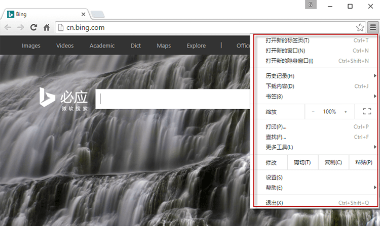
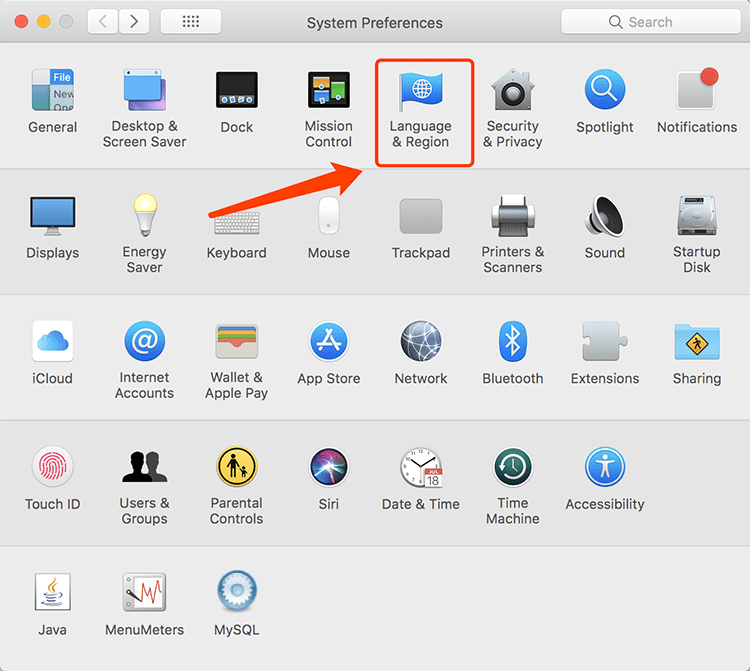
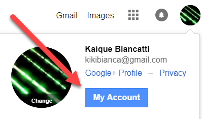
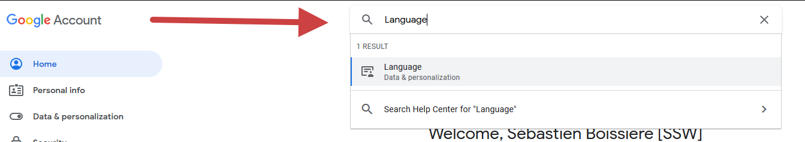
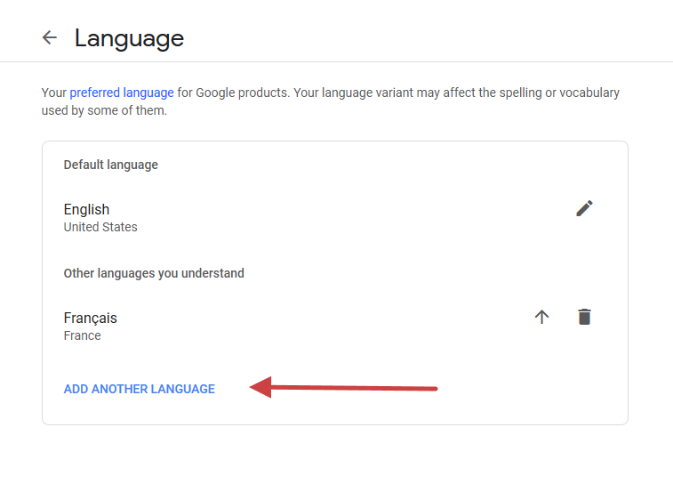
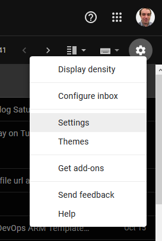
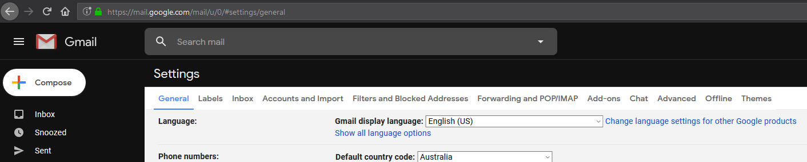
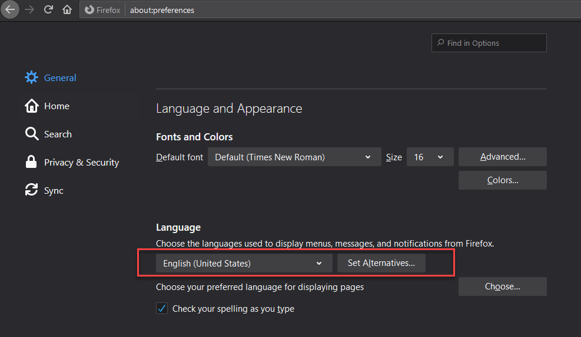

 
​​​​When dealing with western people, you want to avoid having screen captures etc. showing foreign characters.​​

Let us look at some examples:
 
### Google Chrome
Figure: Bad example - Chrome using Chinese as its language settingFigure: Good example - Chrome using English as its language setting
### How to fix on a PC?

You want all screenshots you take to be showing English. Most of the time it is as simple as going Tools | Options | Language | Default Language = English (US).

In Chrome, you can follow these steps directly:

1. Three dots bar at the top right of the Chrome window:            
 ​              
Figure: Blank Chrome page showing the 'Settings' button, 3 small dots
2. Click on Settings:        Figure: Showing the 'Settings' page
3. Click on Advanced:        Figure: Advanced tab in Settings
4. Click on 'Add Languages':        Figure: Add Languages to your current Chrome
5. Move English to the top        Figure: Move English to top

### How to fix on a Mac?

1. Change the language in System Preferences. Go to Apple menu | System Preferences | Language & Region.         Figure: In macOS it’s simple to change to English
2. In Preferred languages, add English and select it as primary language:         Figure: In Language & Region, add English
3. Reboot the system and verify that English is now the primary language for all desktop applications.

### How to fix your Google account?

You should also change your Google language to English as well. If it is not already, take a look at these steps:

1. Go to www.google.com
2. Click on `Sign-In` or `My Account` if you are already signed in         Figure: Google page without an accountFigure: Google page with an account
3. Search for 'Language':        Figure: Search for 'language'
4. Now click `Language` and search for English        Figure: Language picker
5. Move English up to Default language by clicking on the arrow Figure: Move up English
6. Done! You changed your language to English.

### How to fix your Gmail account?

1. Click on the cog then Settings        Figure: Access to Settings on Gmail
2. Set language to English(US)        Figure: Change language setting
3. Scroll down and click on 'Save Changes'. Done!

### How to fix Mozilla Firefox?

1. Go to Options        Figure: Access to Firefox options
2. Set Display language to English(United States), you may have to restart Firefox to apply the change        Figure: Language settings
3. Choose your preferred language for displaying pages. Add English(UnitedStates) and move it to the top.        Figure: Click Choose to change your preferred language
Figure: Add English(United States) to your preferred language for displaying pages
4. Done!

### How to fix on MS Azure?
 Figure: In Azure https://portal.azure.com it is as simple as clicking on the Cog icon
### How to fix on MS Office 365 (rich client)

Figure: The Office 365 cog does not show the language. Some cheap versions of Microsoft Office 365 only allow Chinese, so you need to uninstall and install the English version. It requires you to download a language pack which is a bit more of a hassle...
Figure: If you do not have the English version. In Microsoft Office open the rich client application such as Outlook or Word, then install and configure as per the image above 
### How to fix on Office 365 (https://outlook.office365.com)

  ​       Figure: If you have the Inbox, Sent Items etc in Chinese then you will need to follow these steps
​​
​   1. Go to ​​https://outlook.office.com
   2. Click on "My profile"​​ in the top right corner​

​  **Figure: Choose 'My profile'****
**   3. Click on "setting" button
​​  **Figure: Choose 'Mail'****
**    4. Click on Region and time zone
​  Figure: Choose Region and Time. Then when you change the ‘Language’ with the checkbox enabled, the problem will be fixed.

    5.In Windows10, Go to Settings| Language| Windows display language, click Windows display language and search for English.​
    6. Done. You have changed your language to English. Congratulations!~
​​​  ​  ​**Figure: After completing the fix.**

