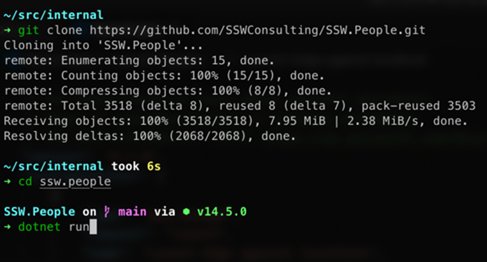
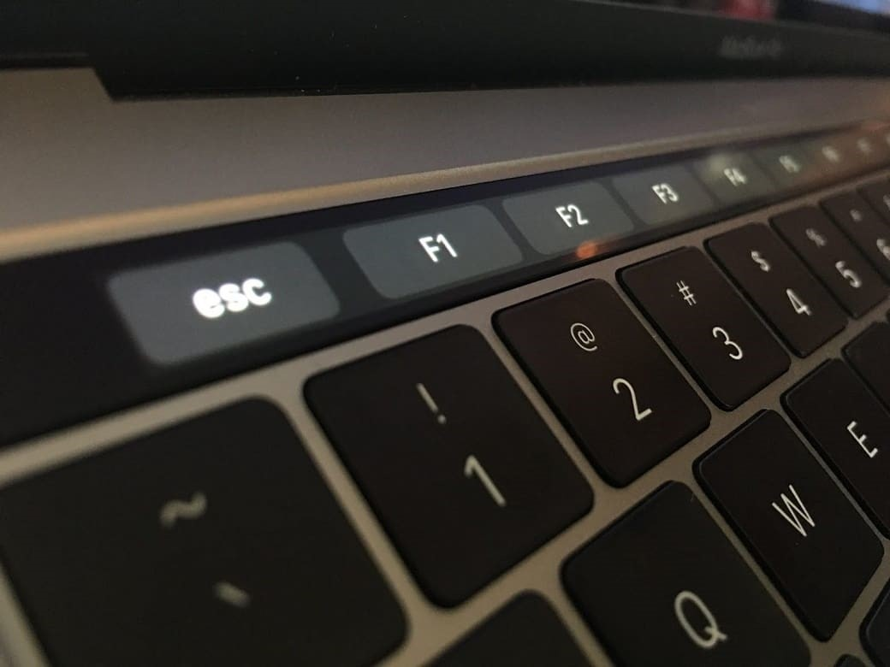
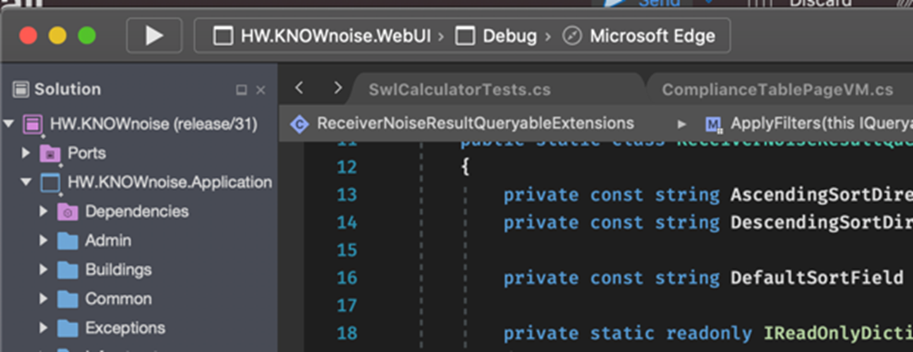

It's amazing how often you can't simply Clone a repository (aka "Get Latest") and compile it.

A good developer makes it clear how to get a new project, compile it, and have a smooth "F5" experience.

<!--endintro-->

Check they have a README or instruction files in their solution as per the rule [Do you make instructions at the beginning of a project and improve them gradually?](/_layouts/15/FIXUPREDIRECT.ASPX?WebId=3dfc0e07-e23a-4cbb-aac2-e778b71166a2&TermSetId=07da3ddf-0924-4cd2-a6d4-a4809ae20160&TermId=d6d34c31-ac6a-49a4-876a-f9d30e1ab78a)

### Sometimes the experience is more CLI based

(Do you get latest and compile) to be more a “git clone” and then “dotnet run”
### Sometimes the experience is more Mac-based

(similar to F5)

