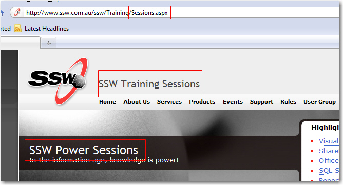

 
It's a good idea to make sure your page names are consistent       between:

1. URL
2. Page Title
3. Navigation

 Figure: Bad example - Inconsistency everywhere!Figure: Good example - Title, Header and Navigation Menu item have the same text.
