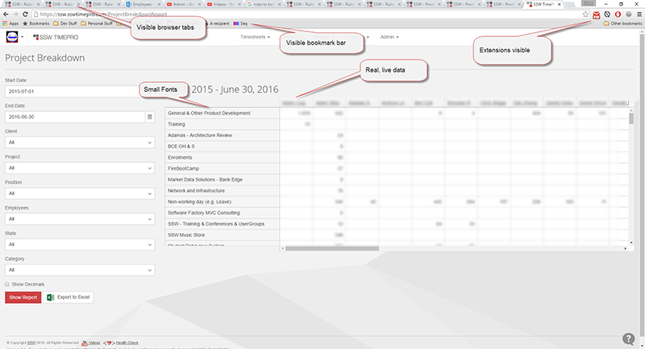

As developers, we are used to having our screen efficiently set up – often these means small fonts, visible bookmark bars and a huge amount of browser tabs and taskbar items.
 
While this is great for efficiency, it is not very good for recordings or presentations, and the clutter should be removed.

[[badExample]]
| 

[[goodExample]]
| 
