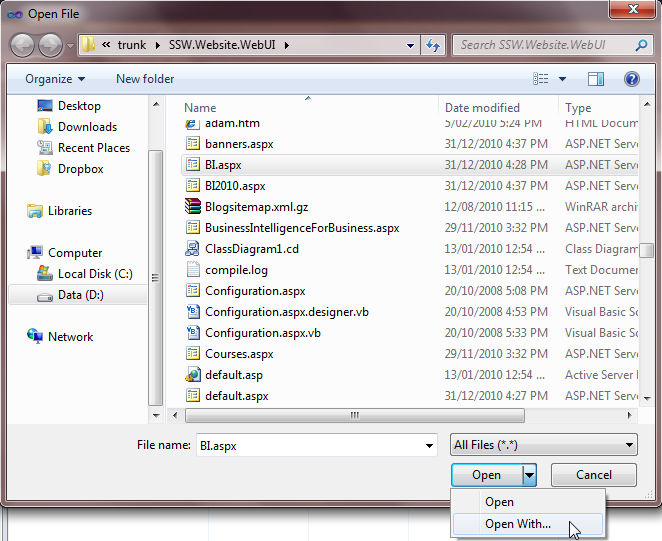
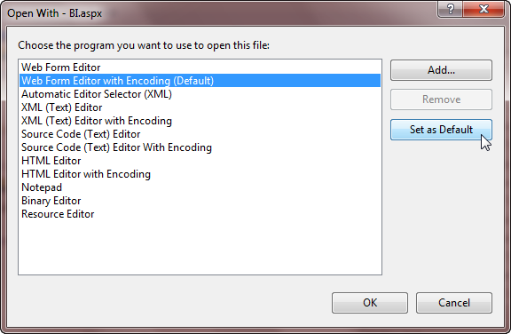
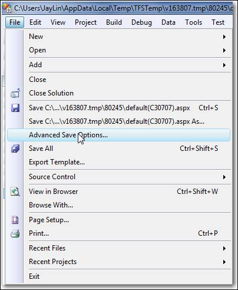
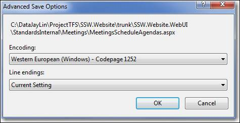

 
Make sure your Visual Studio encoding is consistent with Sydney to avoid encoding problems in the future.
 
**Open file with Encoding:**
   Figure: Use "Open With...&Figure: Use "Open With..." in Visual Studio to open the file   Figure: Set "... Editor with Encoding" as the Default Editor   Figure: Make sure your encoding is consistent with Sydney 
**Save file with Encoding:** (Optional - it will be saved w (Optional - it will be saved with opened encoding automatically.)
    Figure: Open "Advance Save Options..." in Visual Studio before checking in   Figure: Make sure your setting is consistent with Sydney 
