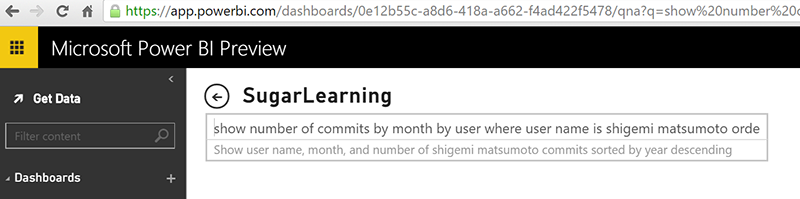
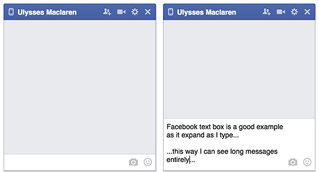

Text boxes are often limited in size. When the user have a large ammount of text, the field should grow bigger to show the whole query.

<!--endintro-->
<dl class="badImage"><dt>
      
   </dt><dd>Figure: Bad example - Can't see the whole query</dd></dl><dl class="goodImage"><dt>
      
   </dt><dd>Figure: Good example - Text area expands showing the entire message as it is typed</dd></dl>
More info:

* http://blogs.sitepointstatic.com/examples/tech/textarea-expander/demo.html
* http://www.sitepoint.com/build-auto-expanding-textarea-1/
