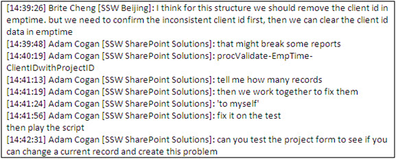
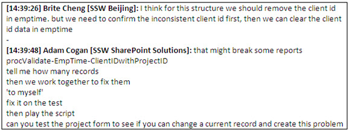

Once you have decided to put an IM chat into an email or manager may suggest a course of action or a piece of work that they would like completed. It's highly important that such chats are copied from the chat screen, pasted into an email, and sent to the client or manager with a note: "Confirming our IM chat this morning", and CC'ing anyone else who is relevant. Don't just paste the whole conversation into an email.
Snip the relevant information only. You can do this by:

 
1. Deleting junk that is not related to the conversation
2. Deleting repetitive junk that makes it hard to read (like peoples’ names)
3. Adding a line break between people and highlighting the person's name in **BOLD**

 **
** 

[[badExample]]
| 

[[goodExample]]
| 
