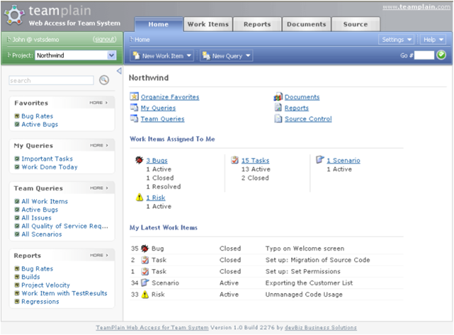

 
You should put all the useful and current information on the homepage and also make it easy to find your core functions there.
   ​
E.g. Top billing customers for the month and a button under it for adding an invoice.
E.g. See the number of bugs counted by the most common.
Figure: The homepage of TWA is a portal.Figure: Adobe's Creative Suite also opens a portal 'homepage'.
