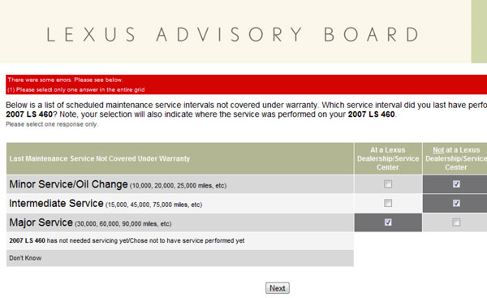
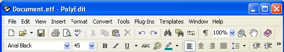

1. When we see a door, we immediately know that we can open it and go through it
2. Links in blue and underlined has an affordance of clickability
3. Buttons can be pressed
4. Scrollbar moves the document in the window

   
[[badExample]]
| 
[[badExample]]
| 
[[badExample]]
| 
[[badExample]]
| 
[[goodExample]]
| 
