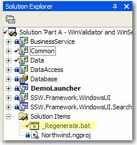

If you projects is generated by code generators ([Code Smith](http://www.ssw.com.au/ssw/Standards/Developergeneral/netTools.aspx#NetTiers), RAD Software NextGeneration, etc.), you should make sure it will be regenerated easily.<br> 
Code generators can be used to generate whole Windows and Web interfaces, as well as data access layers and frameworks for business layers, making them an excellent time saver. However making the code generators generate your projects for the first time takes much time and involves lots of configurations.

In order to make it easier to do the generation next time, we recommend you putting the command line of operations into a file called "\_Regenerate.bat". When you want to generate it next time, just run the bat file and all things are done in a blink.


```
cs D:\DataDavidBian\Personal\New12345\NetTiers.csp
```

Figure: An example of command line of Code Smith for NorthWind
Thus "\_Regenerate.bat" file must exist in your projects (of course so must other necessary resources).


