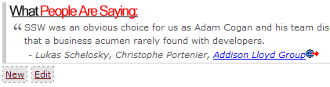

If you have database driven pages on your website, you need a way of updating the data quickly and easily. **Each page should have an 'Edit' link** - only visible when the site is running internally or in administrator mode - that takes you directly to the page for editing the content on that page.
 

From Github, you can edit and submit a pull request. See https://github.com/SSWConsulting/People#how-to-publish-your-changes for more details.

This is better than sending a 'Change from X to Y' email ([http://rules.ssw.com.au/do-you-ask-for-content-changes-using-from-x-to-y](/_layouts/15/FIXUPREDIRECT.ASPX?WebId=3dfc0e07-e23a-4cbb-aac2-e778b71166a2&TermSetId=07da3ddf-0924-4cd2-a6d4-a4809ae20160&TermId=172019d0-82fc-4d7b-9d91-ded321714309)) as the work can be done immediately with less work and management requirements.

### Related Rule

- [Do you use Markdown to store your content?](/_layouts/15/FIXUPREDIRECT.ASPX?WebId=3dfc0e07-e23a-4cbb-aac2-e778b71166a2&TermSetId=07da3ddf-0924-4cd2-a6d4-a4809ae20160&TermId=a7b84edd-3378-423c-b8b7-a8590b454f85)
