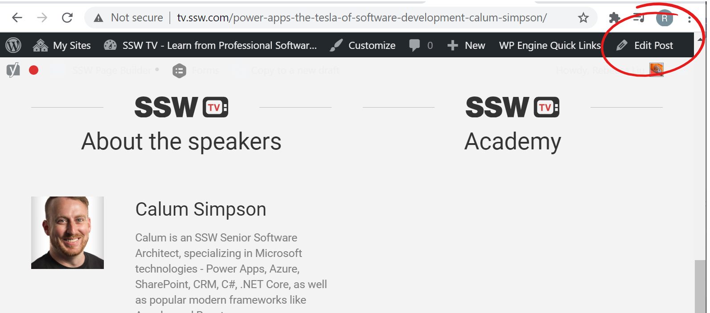

If you have database driven pages on your website, you need a way of updating the data quickly and easily.   **Each page should have an 'Edit' link** - only visible when the site is running internally or in administrator mode - that takes you directly to the page for editing the content on that page.
  The exception to this is if you are using open-source data. [SSW.People](https://ssw.com.au/people/) is a good example of this.

<!--endintro-->
<dl class="ssw15-rteElement-ImageArea"><dt> 
       
   </dt><dd> 
       <strong>Figure: "New" and "Edit" links allow SSW Employees to maintain testimonial entries easily</strong> </dd></dl>
<dl class="ssw15-rteElement-ImageArea"><dt> 
       
   </dt><dd> 
       <strong>Figure: "Edit" button on WordPress admin bar</strong> </dd></dl>
<dl class="ssw15-rteElement-ImageArea"><dt> 
       
   </dt>  ::: good Figure: Good Example - "Edit" button on an Open Source page  :::  </dl>
From Github, you can edit and submit a pull request. See     https://github.com/SSWConsulting/SSW.People.Profiles/wiki for more details.

This is better than sending a 'Change from X to Y' email ([http://rules.ssw.com.au/do-you-ask-for-content-changes-using-from-x-to-y](/Change-from-X-to-Y)) as the work can be done immediately with less work and management requirements.

### Related Rule

<dl class="ssw15-rteElement-ImageArea"><dt> 
       
   </dt><dd> 
       <strong><a href="/Using-GitHub-and-Markdown-to-store-you-content">Do you use Markdown to store your content?</a></strong>  </dd></dl>
