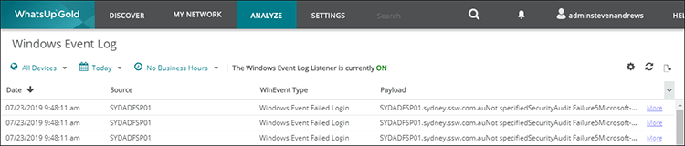

It is important to monitor failed login attempts to determine if you are being attacked from an external source or are having failed attempts from users within your organisation. This can be achieved with Passive Whats Up Gold Monitor.
 

[[goodExample]]
| 
See:     [Do you use Group Policy to enable auditing of logon attempts?](/_layouts/15/FIXUPREDIRECT.ASPX?WebId=3dfc0e07-e23a-4cbb-aac2-e778b71166a2&TermSetId=07da3ddf-0924-4cd2-a6d4-a4809ae20160&TermId=aa9c011d-81de-4d79-82af-a80215ccb131)
