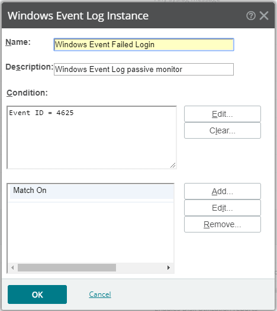

It is important to monitor failed login attempts to determine if you are being attacked from an external source or are having failed attempts from users within your organisation. This can be achieved with Passive Whats Up Gold Monitor.

<!--endintro-->
<dl class="image"><dt></dt><dd>Figure: This Passive Monitor can then be applied to your Servers</dd></dl><dl class="image"><dt></dt><dd>Figure: Good example - This Passive Monitor will then record failed login attempts</dd></dl>It is important to also ensure that you have "Audit logon events" Group Policy applied to servers for source information on the login. 
See:     [Do you use Group Policy to enable auditing of logon attempts?](/use-group-policy-to-enable-auditing-of-logon-attempts)
