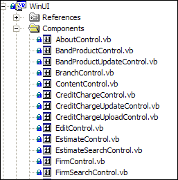
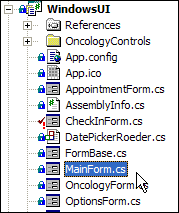

In every Windows application project, we need to have a main, start-up or wizard page  form for a better structure and design.  

| We have a program called [SSW Code Auditor](http://www.ssw.com.au/ssw/CodeAuditor/Default.aspx#VBMainForm) to check for this rule.              Note: In Code Auditor we check for Form named: Startup, MainForm and WizardPage. |
| --- |
