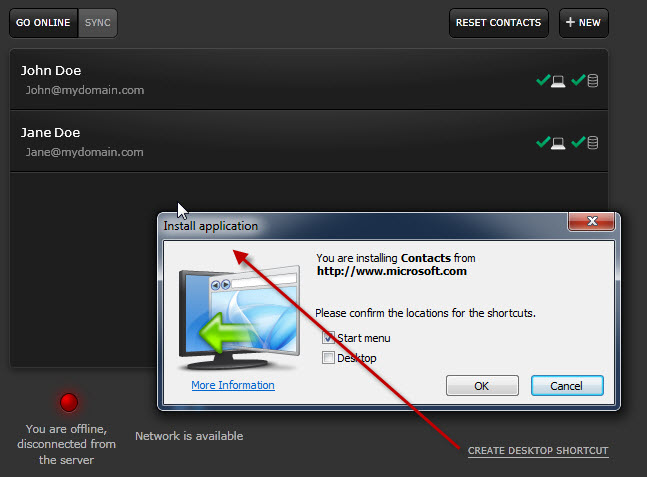

Silverlight out of browser enables the application to be placed in a restricted store on the user’s machine; and then provide a link directly to it from the user’s desktop or start menu. This is all enabled within Silverlight without any additional download of runtime or the need to write applications in a different way.   
An application can now be easily found on the user’s desktop or start menu, and launched with a single click. However is not easy to do, the main difficulty, is that you do not have the HtmlPage object, so if you were relying on IFrame pop up or javascript, or if you are using Silverlight's navigation framework (e.g. silverlight.aspx#Contacts/JohnDoe).

