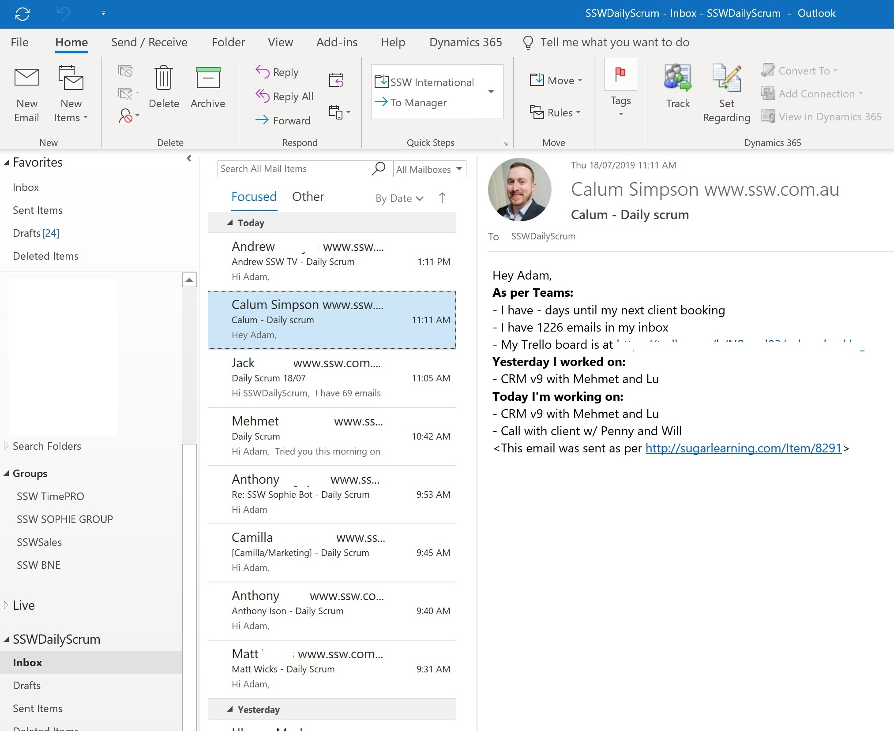

Daily Scrum is an important part of operations, and making sure that your staff has participated in Daily Scrum activities helps to keep projects and team operations on track.

Daily Scrum meetings can be conducted in person or virtually (by email or by tools like Microsoft Teams), and should be completed everyday to make sure product owners are stakeholders are up to date on what is happening.  See [Do you do Daily Scrums (aka stand up meetings)?](/_layouts/15/FIXUPREDIRECT.ASPX?WebId=3dfc0e07-e23a-4cbb-aac2-e778b71166a2&TermSetId=07da3ddf-0924-4cd2-a6d4-a4809ae20160&TermId=731a3f5d-a266-4944-876c-a45afa82832f)
 

1. If you participate in any Daily Scrum meetings, ensure you are prepared to discuss your planned work, your prior period’s work, and any blockers you need help with.
2. If you are the Scrum Master, ensure that you are responding to any team blockers or taking action on individual matters as they impact your scrum team.
3. If sending a Daily Scrum update by email or other virtual communication, ensure that it's done by Noon.  This allows your Scrum Master or product owner to be fully informed of what's going on in a timely manner. 

4. Ensure your staff send their Daily Scrum to their product owners as per product owner specification.  Make sure to check that all staff have participated in or submitted their Daily Scrum activities so that product owners are kept up to date.  If staff are sending in Daily Scrum emails, consider sending them to a company Daily Scrum inbox where you can check quickly to see who has sent their Daily Scrum email.
5. If your staff are sending a Daily Scrum email, ensure you use a consistent format from day to day to prevent any confusion.

