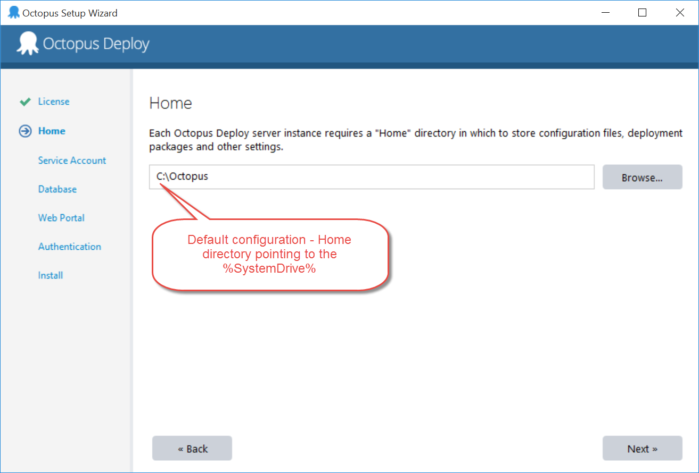
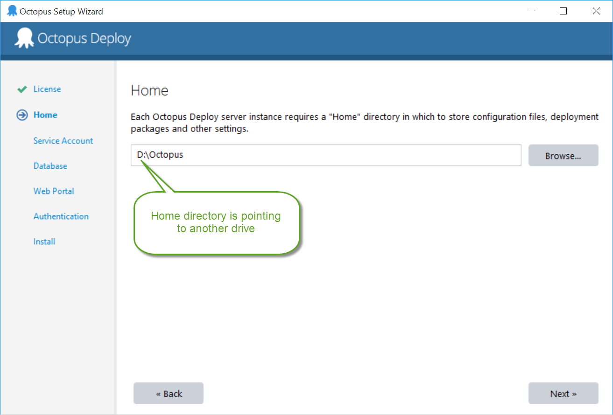

When you run Octopus Deploy setup the application installs to you %Program Files%\Octopus Deploy folder. If you installed Octopus Server you will see Server subfolder and if you installed Octopus Tentacle then it will be Tentacle. However, this is a folder where Octopus Deploy bits live, not your applications, packages, etc. Those artifacts live in the Home folder that you specify during the Octopus Setup Wizard the first time you configure the Server/Tentacle.
   By default the Home directory points to %SystemDrive%\Octopus which is not great. The main reason is that the Home folder is constantly growing and clogging up your OS drive. So you need to point the Home folder to a new drive e.g. D:\Octopus

Bad Example - Home directory is pointing to %SystemDrive%

Good Example - Home directory is pointing to another drive
