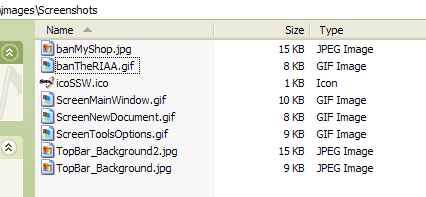

 
It is important to sensibly name your images. We don't use "img" (in the same way we don't use "tbl" for tables).

However, for special types of images we do include a prefix.
 

| **Image Type** | **Prefix** | **Example** |
| --- | --- | --- |
| Banner | ban | banSSW.gif |
| Icon | ico | icoSSW.ico |
| Screenshot | Screen | ScreenCodeAuditorMainWindow.gif |

Figure: Correctly named images​  
