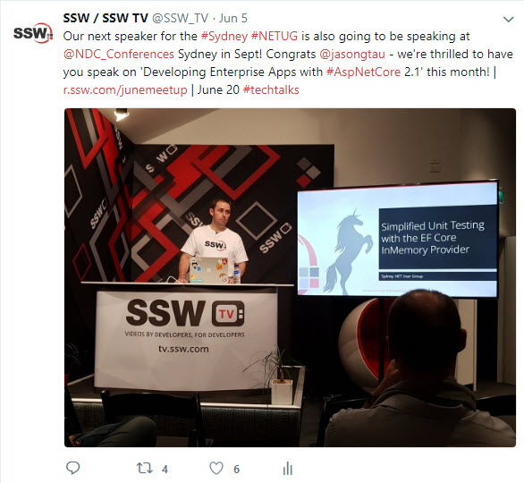

Do you need to increase the attendance at your User Groups?
 
A great way to increase your over all audience, as well as your attendance at each User Group, is to use social media and online forums like MeetUp to advertise your events. At SSW we use MeetUp, as well as the social media platforms, Twitter, Facebook, Instagram and LinkedIn to announce all of our upcoming User Groups and keep track of attendance.

**     Figure: An example of SSW promoting the .NET User Group on Twitter.

**
You can read more about promoting your events here in our [Rules to Better Twitter (plus Facebook and other Social Networking)](/_layouts/15/FIXUPREDIRECT.ASPX?WebId=3dfc0e07-e23a-4cbb-aac2-e778b71166a2&TermSetId=07da3ddf-0924-4cd2-a6d4-a4809ae20160&TermId=42ac98b1-427f-4ac8-823d-f2b4c258e16b) and in [Promotion - Do People Know About Your Event. ](/_layouts/15/FIXUPREDIRECT.ASPX?WebId=3dfc0e07-e23a-4cbb-aac2-e778b71166a2&TermSetId=07da3ddf-0924-4cd2-a6d4-a4809ae20160&TermId=ff9543a1-ea21-4302-91e9-57fa371afa05)
