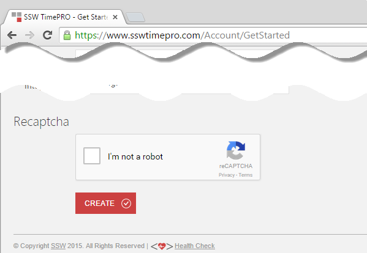
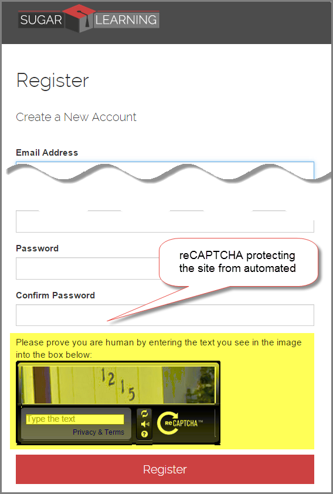
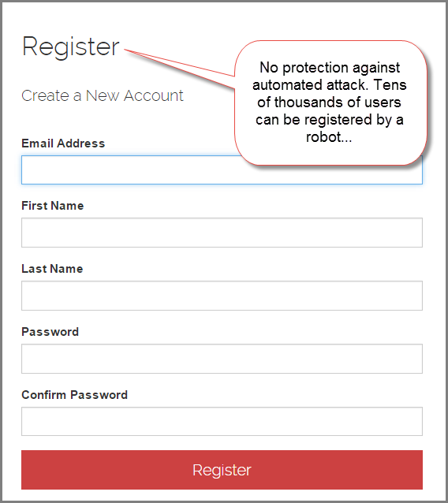

Protecting your site from automated attack is easy with reCAPTCHA.  
Learn how to by clicking [this link](https://shigemimatsumoto.wordpress.com/2015/04/27/protecting-mvc-web-application-with-recaptcha-22/) and improve your site security.

[[goodExample]]
| 

[[badExample]]
| 

[[badExample]]
| 
