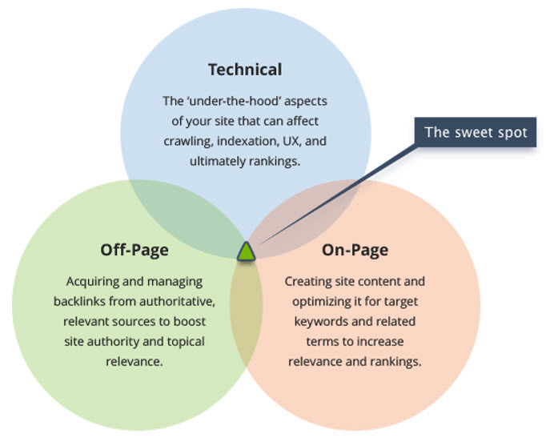

It’s essential to have a functional website. It must be user-friendly and focused on providing the best experience they could have if they are either shopping or looking for information about your business/service. Keep in mind that your call to action is the gateway to increasing your conversions on web pages, so make them obvious, no one likes to hunt for what they need! ​
 ​

