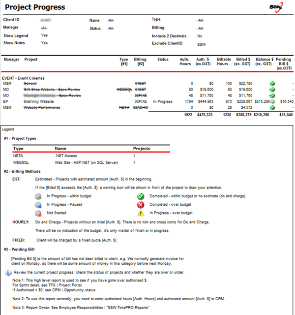

Communication is a critical part in project management and it's essential to provide as much information as possible to your clients so they know the project's progress.

You should provide the following report to clients:  
- Project Progress Report: This report helps clients to review the current project progress, check the status of the project and whether they are over or under estimates.​

