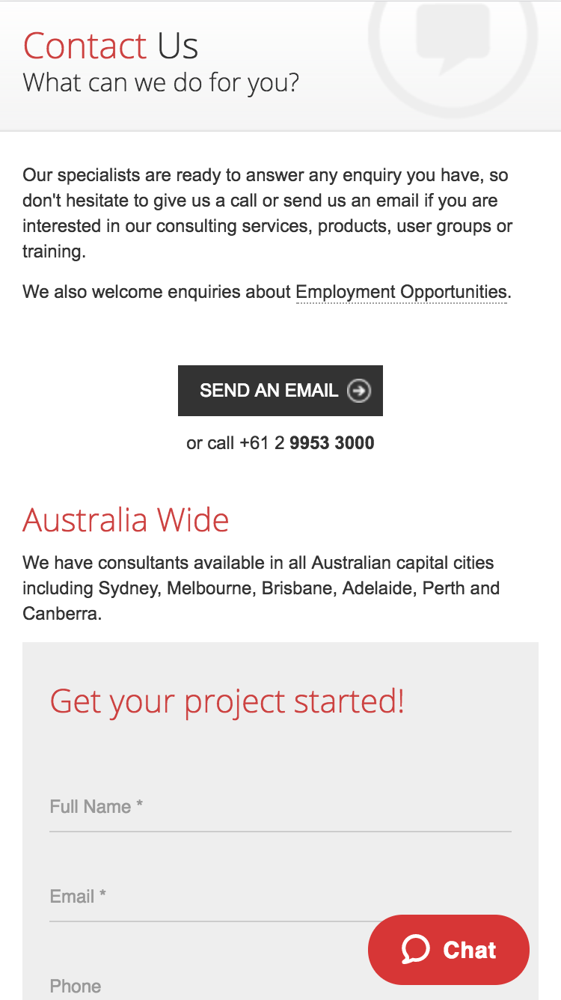

The evolution of website development can be divided by: 

    - 1990 - Cool website – content focus (static HTML content)
    - 1995 - Cool graphics – interface focus (dynamic HTML content)
    - 2000 - Nice flow – usability focus (focus on user experience)
    - 2005 - Good marketing – conversion focus (SEO and visitors to customers conversion)
    - 2010 - Happy customer– interactions focus (customer experience)

 
It's important that your website is focused on CX (Customer Experience) which means you need modern contact options.
  ](moderncontact-bad.png) 
 
 
 
Zendesk explain how you can use mulitple channels of support to give your customers a better CX.
