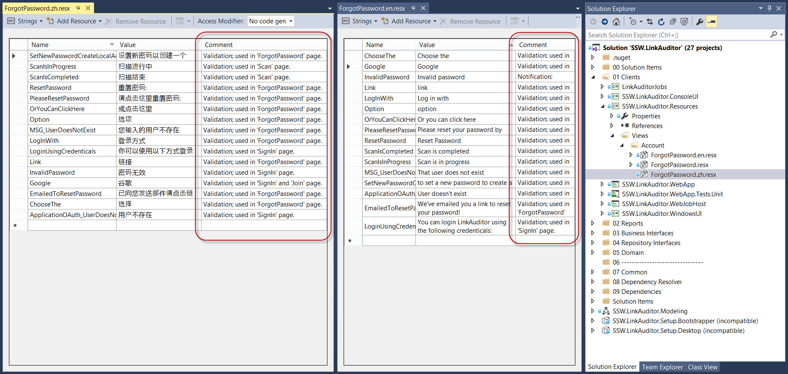

​​Knowing the context and use of certain strings will help translators choose the right translation from the beginning when you localize your web application to make it available in a variety of languages. Most translation tools will allow translators to see these comments as they translate the strings. To make your comments more friendly, it's better to list in the comment field where this text is used. e.g.

- ​Text
- Validation
- Tooltip
- Textbox Placeholder​​

 

