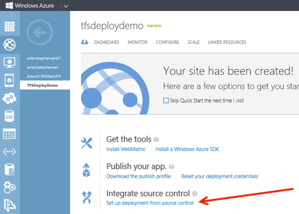
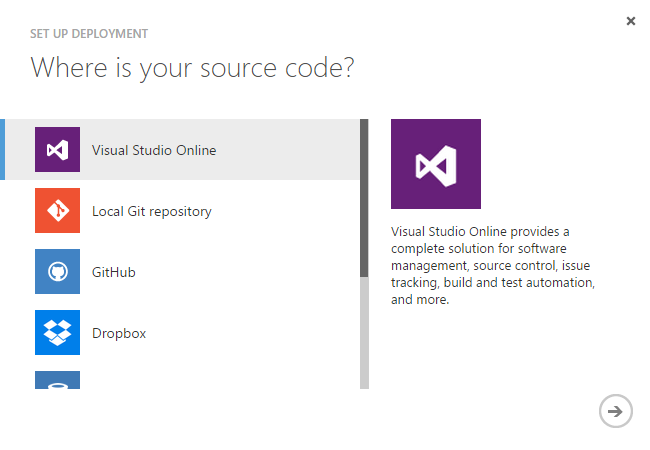

TFS and Windows Azure work wonderfully together. It only takes a minute to configure continuous deployment from Visual Studio Online (visualstudio.com) to a Windows Azure Web Site or Cloud Service.

This is by far the most simple method to achieve continuous deployment of your websites to Azure.
But, if your application is more complicated, or you need to run UI tests as part of your deployment, you should be using Octopus Deploy instead according to the [Do you use the best deployment tool](/Pages/The-best-deployment-tool.aspx) rule.
<!--endintro-->
<dl class="image"><dt>   
   </dt><dd>Figure: Setting up deployment from source control is simple from within the Azure portal</dd></dl><dl class="image"><dt>  </dt><dd>Figure: Deployment is available from a number of different source control repositories</dd></dl>
Suggestion to Microsoft: We hope this functionality comes to on-premise TFS and IIS configurations in the next version.
