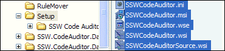

All setup files should stored under setup folder of your project root directory.   
 Good example - All the wise setup file in the \setup folder. 

| We have a program called [SSW Code Auditor](http://www.ssw.com.au/ssw/CodeAuditor/Default.aspx) to check for this rule.  |
| --- |
