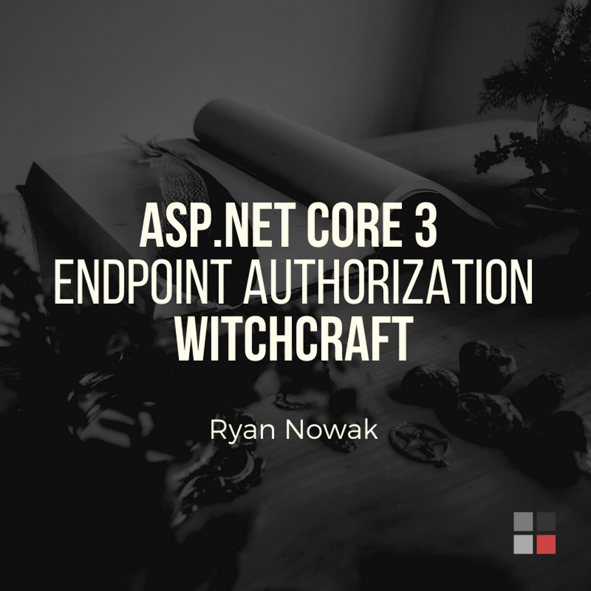

You spend a lot of time and money creating great video content, so you need to make sure that you get the most out of your time and money. 

Content creation wizard Gary V (Vaynerchuk) has shared a great model for this on his blog called the 'reverse pyramid' where you start with a video, that you are able to repurpose into dozens of smaller pieces of content, contextual to the platforms that you distribute them to. 

This could take many different forms — for example, if you’re not comfortable on video, you could record a podcast. You might even film yourself recording the podcast so you could have a video out of it as well. And from that video or audio clip, you can create content for Instagram, Twitter, Facebook, LinkedIn, and more. 

You can find an explanation of the Gary V Content Model at:

- https://www.garyvaynerchuk.com/the-garyvee-content-strategy-how-to-grow-and-distribute-your-brands-social-media-content
- https://www.garyvaynerchuk.com/how-to-create-64-pieces-of-content-in-a-day

 
### STEP 1: CREATE PILLAR CONTENT

This is the content that will be used to create all other types of content. They include:

- Interview
- Q&A
- Presentation
- Educational Video
- Daily Vlog
- Demo

 
**Video: A pillar video shot at NDC Sydney and published on SSW TV, you can cut this video into smaller sections and promote it through social media****
**
### STEP 2: CREATE REPURPOSED CONTENT

The pillar content will be used to create repurposed content to be distributed across the internet. They include:

- Blog Post - transcribe using Trint.com and then rewrite as a blog post
- Podcast Episode - Export audio for podcast
- Follow the process to convert the video into a blog post

### STEP 3: CREATE MICRO-CONTENT

Micro-content is smaller pieces of content created from the pillar content. Each piece of content will be created with the purpose of sending the consumer back to the pillar piece of content.

Each type of micro-content should be created specifically for the platform you are sharing it on.

These are the types of content:

1. Create 2-3 shorter videos that contain the best sections of the pillar content:

- create a version of the video for Facebook, Twitter, LinkedIn and Instagram, and Instagram Story

- use Trint.com to transcribe the video and create subtitle files

- write the copy for the update

 

**Video: An example of a smaller video you can be used to drive traffic to your YouTube Channel**

2. Create a Quotable Card with a great background image:

- create a version of the video for Facebook, Twitter, LinkedIn and Instagram
       - write the copy for the update

   3. Create a Giphy with one of the main points and a moving background video from the pillar content
       - write the copy for the update 4. Create a blog post from the audio
- use Trint.com.to transcribe the video file and re-write the transcript as a blog post

- Post the blog post to Medium.com, LinkedIn Articles, and your blog

### STEP 4: DISTRIBUTE CONTENT

At 12:00pm you should post your pillar content on all platforms. At 12:01 pm you should post all your micro-content.

Remember the micro-content should promote your pillar content.

You should also publish the blog post. You will republish the blog post on other websites in 2 weeks in Step 6

### STEP 5: MONITOR COMMENTS AND REPLY TO ALL

You must reply to all comments and use these comments to find out what content should be created next.

### STEP 6: EMAIL THE BEST VIDEO TO LIST

At the end of the week, you will email the best video out to your list with a listing of the other videos.

### STEP 7: PUBLISH BLOG POST

You need to wait 2 weeks before republishing the blog post to other platforms so Google knows that your website is the source of the blog post.

The sites you will republish to are:

- Medium - Using the WordPress publishing tool
- LinkedIn Articles
- Quora
