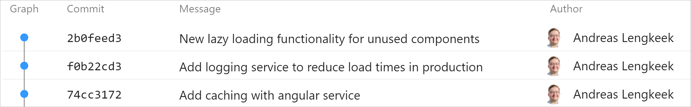

 
Australian R&D laws require you to show the separate attempts you make when developing a feature that counts towards R&D. For this reason, you should make sure to commit in between every attempt you make even if it does not have the desired affect to record the history of experimentation.

 
The below example is for a scenario to improve load times for an MVC to Angular web app. The developer creates a new feature branch and works on their local machine.

Once they are done the developer commits all the changes they made and push it the remote repository. Using this method, the developer loses the history of experimentation and it will be difficult to prove for R&D.

​​Bad Example: Only the final solution is committed. Experimentation history is not recorded​

In this example for the same scenario the developer makes sure to commit every separate​ attempt to reduce load times for their web application. This way, everybody knows what kinds of experimentation was done to solve this problem.

​

Good Example: Each attempt has a new commit and is not lost when retrieving history​​

